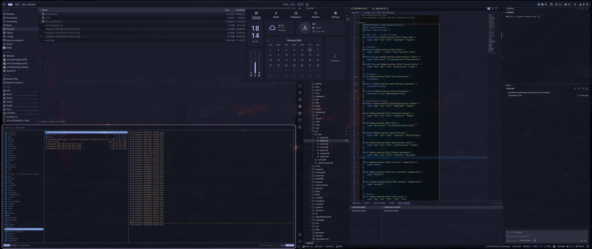
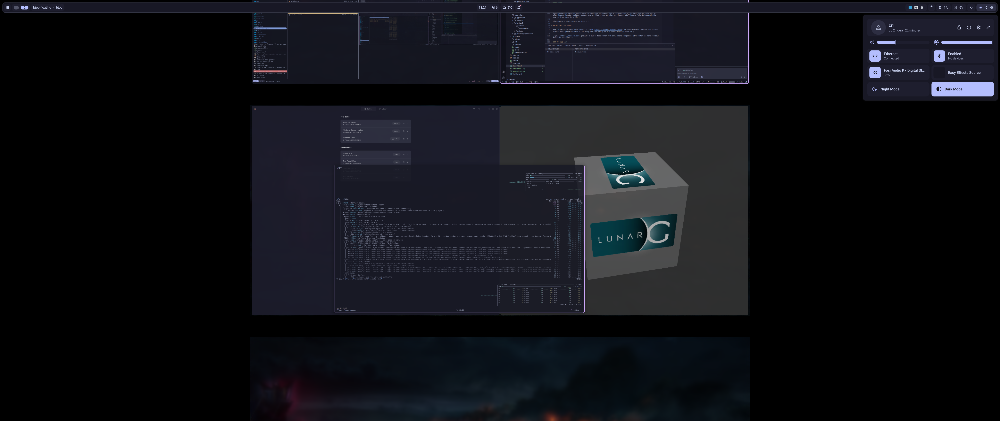

# dotfiles — dotdrift profile

CachyOS setup profile managed by [dotdrift](https://github.com/thedataflows/dotdrift).

This collection of packages, tools and configuration is created to fit my needs and wants, and could be a good starting point for anyone looking for something more than barebones CachyOS.

## Desktop experience: Scrollable-tiling WM with Niri + Dank Material Shell (DMS)

An alternative scrollable-tiling desktop environment available at login (via Plasma Login Manager), alongside the default KDE Plasma. It is fully functional and can be used as a daily driver for me, yet. KDE Plasma is amazing, and the memory footprint is as similar as Niri+DMS.

**Niri** is a scrollable-tiling Wayland compositor that provides a unique workflow where windows are arranged in a scrollable column layout. Combined with **Dank Material Shell (DMS)**, it offers a fairly complete desktop experience with integrated widgets, launcher, notifications, and system monitoring.

Use `Niri` session at login to use it. I have fixed most quirks and issues, and it is now my daily driver to see how it feels.

### Key features

- Text seems sharper compared to KDE Plasma!
- Scrollable-tiling layout as default, fast and buttery smooth.
- DMS provides: top widget panel and bottom docking panel, application launcher (Super+Space), clipboard manager (Super+V), task manager/dgop (Super+Shift+Esc), notification center (Super+N), etc. Ctrl+Shift+/ show a list of the main shortcuts. For all my keybindings, see [binds.kdl](modules/niri/home/.config/niri/dms/binds.kdl)
- Catppuccin Mocha theme throughout
- Uses existing KeePassXC for secrets (no kwallet)
- Using KDE portal for integration, using the same KDE file dialogs, etc. Also uses KDE polkit agent for step-up authentication dialogs.
- Fully integratable with dsearch (filesystem search) and dgop (system monitoring) - I don't use them though, prefer DMS/KDE Launchers and `btop`.




## Layout

A dotdrift profile. Presence is management: every `modules/<id>/module.toml`
is selected automatically — nothing is enabled or disabled by hand.

```
dotdrift.toml          # stub — modules are auto-selected, no hand config here
mise.toml              # tool versions (dotdrift, mise) + PARU env used by hooks
modules/<id>/          # 116 modules (95 user, 21 system-scope)
  module.toml          #   [packages] [dotfiles] (+optional [hooks], +scope="system")
  home/ · usr/ · etc/  #   dotfile sources referenced by [dotfiles]
hosts/<host>/          # per-host layer (cri-laptop, cri-pc)
  modules/<id>/        #   host overlays (per-host generated mount units)
users/<user>/          # per-user layer, highest precedence (currently empty)
```

Hooks: a module's optional `[hooks].post` runs shell commands (as mise tasks,
from the profile root) after its dotfiles land. System-scope modules carry
inline `sudo` — e.g. `system-logind` restarts `systemd-logind`, `mountpoints`
enables its generated `.mount`/`.timer` units. Skip them with `dotdrift apply --no-hooks`.

## Install

This profile is self-contained: [mise](https://mise.jdx.dev) bootstraps both
itself and dotdrift (both listed in `mise.toml`).

```sh
sudo pacman -Sy mise
# or
curl https://mise.run | sh   # install mise → ~/.local/bin
```

```sh
cd ~/dotfiles
mise up                      # installs dotdrift (+ latest mise) from mise.toml
exec $SHELL                  # reload shell so mise shims are on PATH
dotdrift detect              # sanity check: prints host/user/os facts
```

## Usage

- Clone this repo: `git clone https://github.com/cr1cr1/dotfiles`
- Adapt to your needs, eventually fork it
- Dry run: `dotdrift plan`
- Apply globally `dotdrift apply` or a subset of modules: `dotdrift apply module1 module2`

One `apply` covers everything: packages (via the distro backend), user
dotfiles, system dotfiles (via sudo — one password prompt per apply thanks
to sudo's timestamp cache), and hooks. Resume-safe: re-running continues
from the first incomplete step. Skip hooks with `--no-hooks`.

## Information and status

```sh
# Modules listing and Information
dotdrift modules
# Status of the profile (what's applied, what needs to be applied)
dotdrift status --diff
```

## License

[MIT](LICENSE)
